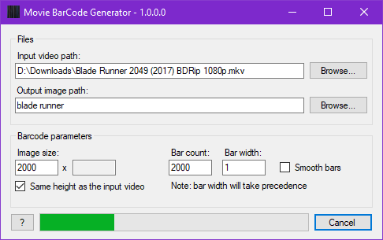
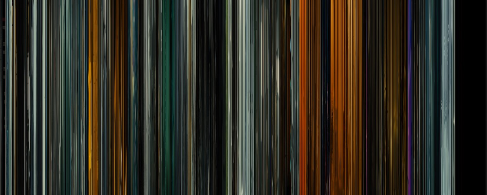
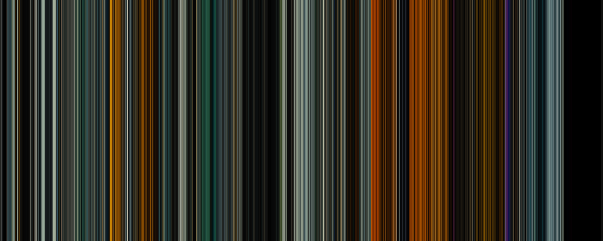

# Movie BarCode Generator

A user friendly tool to generate movie barcodes.

More information here: [zerowidthjoiner.net/movie-barcode-generator](https://zerowidthjoiner.net/movie-barcode-generator)

## Example results

With the "Smooth bars" feature enabled:

## About the code

This tool is based on [FFmpeg](http://ffmpeg.org/).

The code has been written relatively quickly (a few hours), but should be of acceptable quality.

There might be buggy corner cases though.

For the old legacy version based on DirectShow and released in 2011, [see here](https://github.com/mlaily/MovieBarCodeGenerator-Legacy).
